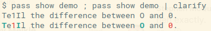

Clarify
==========

Color code numbers and capital letters.



On a command line, and depending on your font, it can be hard to tell the difference between 1lI and O and 0. This happens all the time if you use a command line password manager like [pass](https://www.passwordstore.org/).

Clarify solves this problem by printing numbers in red and capital letters in cyan. Just pipe your output to clarify and you are set.


## Build and install from source

```bash
$ go get github.com/is4tomj/clarify
```

## Example usage
```bash
$ echo "1lIO0" | clarify
```

## Testing
```bash
$ go test
```
